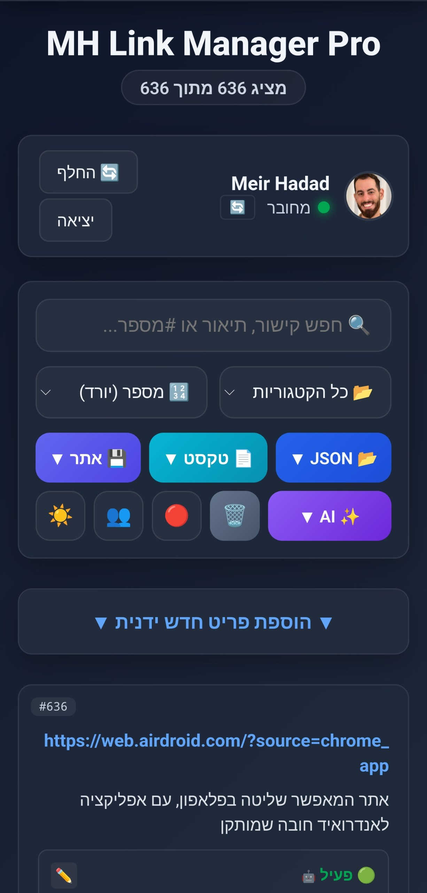

  
  
  <h1>🔗 MH Link Manager Pro</h1>
  
  
<b>מערכת PWA חכמה ומתקדמת לניהול קישורים אישי בענן. משלבת סנכרון מאובטח בזמן אמת, עבודה מלאה ללא רשת (Offline), ומנוע בינה מלאכותית (AI) מרובה-ספקים לסיווג, תקצור ואוטומציה של תוכן הרשת.</b>

  
   
  
    

---

## 🎯 חזון ומטרת המערכת
המערכת **MH Link Manager Pro** פותחה כדי להחליף את מערכות ה"מועדפים" (Bookmarks) המסורתיות והמיושנות של הדפדפנים. האפליקציה מתפקדת כ"מוח שני" עבור קישורים, קטעי קוד וטקסטים חשובים.

במקום לשמור רק כותרת וכתובת אינטרנט (URL), האפליקציה ניגשת באופן אקטיבי לאתר הנשמר. המערכת עוקפת חסימות בסיסיות, קוראת את התוכן שלו, ומעבירה אותו לעיבוד במנועי בינה מלאכותית מתקדמים (LLMs). התוצאה היא מאגר נתונים עשיר שבו כל קישור מלווה בתקציר ענייני בעברית, תגיות חכמות לחיפוש מהיר, וחיווי סטטוס מדויק (האם האתר עדיין פעיל, חונה או שבור).

---

## ✨ יכולות ויחודיות המערכת

### 🤖 אינטגרציית בינה מלאכותית (AI) וסריקת עומק
* **מנוע סריקה מרובה ספקים:** תמיכה מובנית ב-API של **Google Gemini** (ברירת מחדל), **Groq** (עבור Llama 3 סופר-מהיר), ו-**OpenRouter**. המערכת מאפשרת מעבר מהיר בין המנועים במקרה של ניצול מכסות (Rate Limits).
* **חיווי זהות מודל (AI Traceability):** המערכת שומרת ומציגה ויזואלית (באמצעות אייקון ו-Tooltip) איזה מודל ספציפי (למשל `Gemini 1.5 Flash` או `Llama 3`) ביצע את ניתוח התוכן של כל קישור.
* **אלגוריתם טלגרם חכם (Telegram Dead-Link Detection):** מנגנון פענוח ייעודי לקישורי טלגרם המנתח את דף ההזמנה באופן מקומי. המנגנון יודע להבחין בצורה מדויקת בין ערוצים תקינים לבין קישורי הזמנה פגי-תוקף, בוטים מחוקים, או דפי "Join Group" גנריים וריקים מתוכן.
* **עקיפת הגנות וחילוץ תוכן (Anti-Bot Bypass):** המערכת שולפת תוכן דינמי ממערך שרתי Proxy מקביליים (כדי לעקוף הגנות כגון Cloudflare) בטרם שליחתו לניתוח AI.
* **אופטימיזציה לחיפוש (SEO אישי):** יצירת תקצירים בעברית תקנית תוך הגדרה מחמירה ל-AI לשמור על שמות מותגים, מונחים טכניים וקוד בשפת המקור (אנגלית) ובתוך תגיות (Hashtags), למקסום יעילות החיפוש העתידי.

### ☁️ ארכיטקטורת ענן, סנכרון ועבודה ללא רשת (Offline)
* **אסטרטגיית עדיפות מקומית (Offline First):** האפליקציה בנויה על בסיס IndexedDB לאחסון מקומי ו-Service Workers לניהול מטמון. התוצאה: זמני טעינה אפסיים ויכולת קריאה, חיפוש ועריכה מלאה גם במצב טיסה (ללא אינטרנט כלל).
* **תור סנכרון מאובטח (Push Queue Architecture):** מנגנון תור אסינכרוני הדואג שפעולות שמירה ל-Firebase יבוצעו באופן טורי ומבוקר, ומונע דריסת נתונים בעבודה במקביל על מספר מכשירים.
* **מנוע ייבוא וגיבוי חכם (Smart Merge):** בעת ייבוא קבצי גיבוי (JSON או TXT), המערכת מפעילה מנגנון מיזוג המזהה פריטים קיימים (לפי ID או תוכן) ומעדכן אותם מבלי ליצור כפילויות.

### 🎨 ממשק משתמש (UI/UX) וחוויית שימוש
* **בחירה מרובה תלוית-הקשר (Smart Multi-Select):** ממשק המאפשר בחירת עשרות פריטים *מתוך מה שמוצג כרגע על המסך בלבד* (בהתחשב בסינון וחיפוש פעיל), להעברת קטגוריה, מחיקה או **סריקת AI ממוקדת לנבחרים**.
* **עיצוב זכוכית מודרני (Glassmorphism):** ממשק נקי ויוקרתי, המגיב בזמן אמת וכולל מעבר חלק בין מצב יום ללילה (Dark Mode).
* **מערכת התראות חכמה (Toasts):** חיוויים צפים דינמיים הדוחפים אוטומטית אלמנטים אחרים (כמו כפתור הגלילה) כדי לא להסתיר ממשק פעיל.

### 🛡️ אבטחה, פרטיות ושליטה
* **הגנת חוקרי קוד (DevTools Protection):** מנגנון ייעודי לזיהוי וחסימה של פתיחת כלי המפתחים (Console/Inspect Element). המנגנון מגן על סביבת העבודה ונסגר אוטומטית רק עבור משתמש מנהל מורשה.
* **ניהול אשפה בטוח:** סל מחזור (Trash) לשמירת פריטים שנמחקו (Soft Delete) ומאפשר שחזור קל ומהיר.
* **אימות גוגל (Firebase Auth):** גישה לנתונים מותנית בהתחברות מאובטחת. הנתונים בענן מבודדים ברמת ה-UID של המשתמש.

---

## 📁 מבנה הקבצים בפרויקט

| קובץ | תפקיד מהותי |
| :--- | :--- |
| `index.html` | קובץ הליבה של ה-SPA. מכיל את כל מבנה ה-HTML, עיצוב ה-CSS המוטמע (לביצועים מקסימליים), ולוגיקת ה-JavaScript (Vanilla) המלאה המנהלת את ה-State, ה-UI והתקשורת. |
| `manifest.json` | קובץ הגדרות ה-PWA. מגדיר את צבעי המערכת, תצוגה עצמאית (Standalone), אייקונים, ותצורת ההתקנה כאפליקציית שולחן עבודה / מובייל נטיבית. |
| `sw.js` | קובץ ה-Service Worker. אחראי על יירוט בקשות רשת (Fetch Interception), ניהול אסטרטגיית Network-First, ועדכון גרסאות חלק למשתמש הקצה. |
| `icon.png` | האייקון הרשמי של המערכת המוצג במסכי הבית ובשורת המשימות. |

---

## 🔑 התקנת מפתחות API לבינה המלאכותית

כדי שהמערכת תוכל לתקשר עם מודלי השפה ולסרוק תוכן, יש לספק מפתח API. הפעולה נדרשת פעם אחת בלבד:

1. צור מפתח חינמי באחד מהשירותים הנתמכים:
   - **Google Gemini API (המומלץ ביותר):** [Google AI Studio](https://aistudio.google.com/app/apikey)
   - **Groq API (מהירות מקסימלית):** [Groq Console](https://console.groq.com/keys)
   - **OpenRouter API:** [OpenRouter Keys](https://openrouter.ai/keys)
2. היכנס לאפליקציה ופתח את תפריט **✨ AI**.
3. לחץ על **⚙️ הגדרות AI ומפתחות**.
4. הדבק את המפתח בתיבה המתאימה, בחר את המנוע המועדף לסריקה ולחץ שמור.

---

## 💻 מחסנית טכנולוגית (Tech Stack)

* **Frontend Engine:** Vanilla JavaScript (ES6+), HTML5
* **Styling:** Custom CSS Variables, Animations, Responsive Grid/Flexbox, Glassmorphism
* **Backend & Cloud:** Firebase V10 SDK (Firestore Database, Google Authentication)
* **Web APIs:** Progressive Web App (PWA), Service Workers, IndexedDB, Web Share API, Clipboard API, ResizeObserver
* **AI & Fetching:** REST API Integration (Google Generative Language, Groq OpenAI-compatible, OpenRouter), CORS Proxies

 

  פותח ותוכנן על ידי MH. נתונים מאובטחים על ידי תשתית הענן של Google Firebase.

